Linux-Server-Matlab使用手册
==================================================

Date: 2019.3.30     
Author: Xu Yi   
Version: 1.0    
URL: https://github.com/SherlockHsu/Linux-Server-Matlab-Manual

## 目录

- [一、在simulator用户主目录建立个人目录](#一在simulator用户主目录建立个人目录)
- [二、对MATLAB项目进行预处理](#二对matlab项目进行预处理)
- [三、将仿真目录传入服务器个人目录](#三将仿真目录传入服务器个人目录)
- [四、在Linux服务器上运行仿真程序](#四在linux服务器上运行仿真程序)
- [五、将结果传回本地](#五将结果传回本地)

## 一、在simulator用户主目录建立个人目录

为了便于管理，所有仿真人员均使用用户simulator登录服务器。而为了区分各仿真人员的内容，建议所有仿真人员在simulator主目录中创建个人目录，步骤如下：

1. 在CMD/PowerShell/WSL使用ssh命令登录服务器10.129.4.22（以CMD为例）
    > ssh simulator@10.129.4.22

    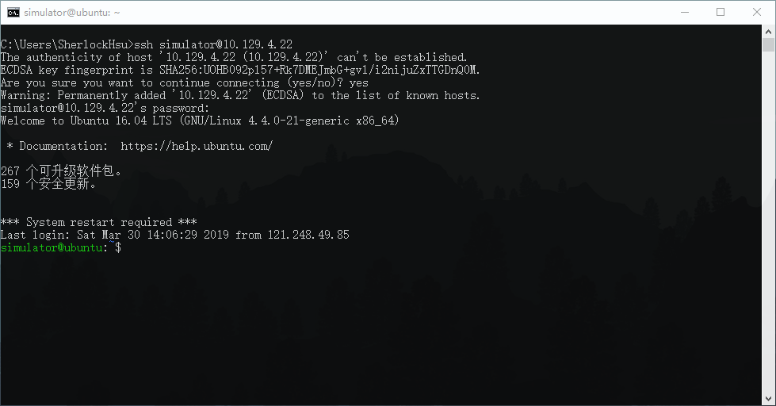

2. 创建个人目录[user_name]
    > mkdir [user_name] 

    例：
    > mkdir xuyi

3. 查看是否创建成功
    > ls

    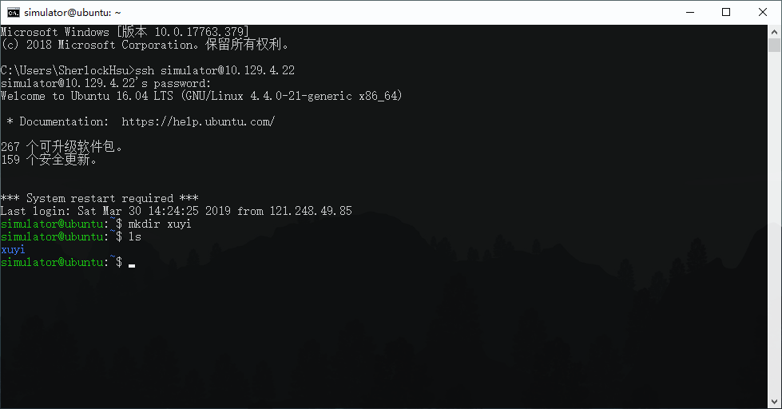

## 二、对MATLAB项目进行预处理
1. 将figure相关操作分离

    由于Linux服务器没有GUI界面，fig文件无法生成，figure相关操作需要在本地进行。

2. 在MATLAB脚本中添加save命令

    为了在本地处理数据，可用save命令将仿真结果存入mat文件，并用scp命令传回本地。（scp命令将在后文介绍）

    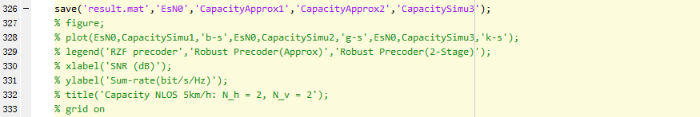

## 三、将仿真目录传入服务器个人目录
1. 使用CMD/PowerShell/WSL并进入仿真目录的上级目录。
    > cd [path]

    例：
    > cd C:\Users\SherlockHsu\OneDrive\Current_Work

2. 利用scp命令将仿真目录上传至服务器个人目录。
    > scp -r [simulation_folder] simulator@10.129.4.22:~/[user_name]

    例：
    > cd C:\Users\SherlockHsu\OneDrive\Current_Work

    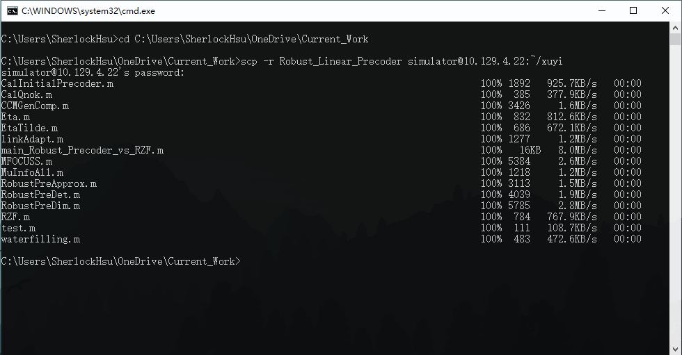

## 四、在Linux服务器上运行仿真程序
1. 登录服务器10.129.4.22
    > ssh simulator@10.129.4.22

2. 利用screen命令建立名称为[screen_name]的新窗口（这里建议使用姓名或项目名作为[screen_name]）
    > screen -S [screen_name]

    例：
    > screen -S xuyi_precoding

    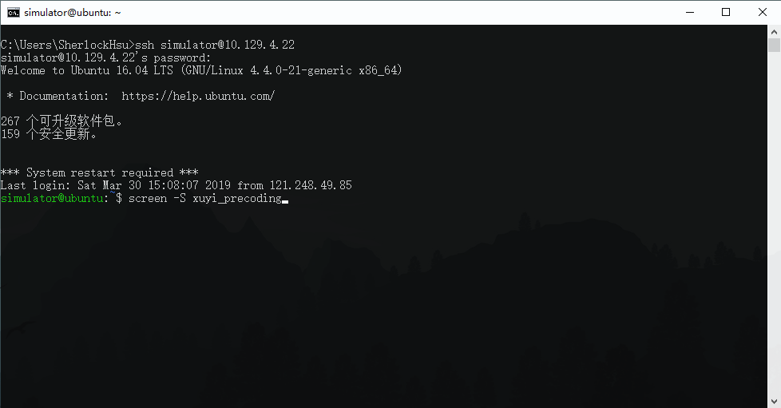

3. 进入仿真目录
    > cd [user_name]/[simulation_folder]

    例：
    > cd -S xuyi/Robust_Linear_Precoder/

4. 运行MATLAB
    > matlab

    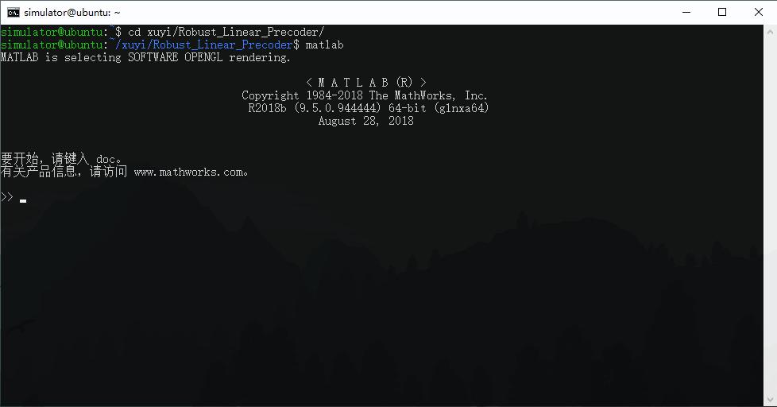

5. 运行脚本[script_name]（注：不带.m）
    > [script_name]

    例：
    > main_Robust_Precoder_vs_RZF

    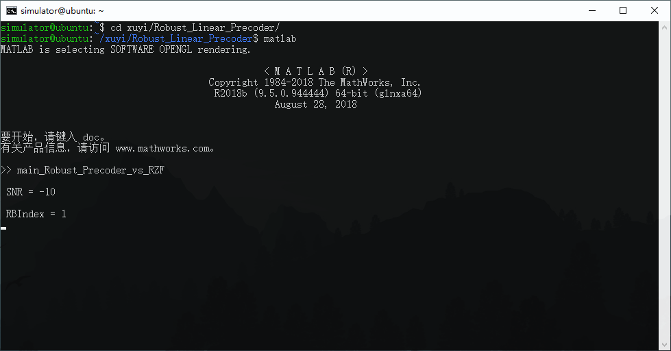

6. 若运行时间较长，可将该screen挂起至后台
    > 快捷键 Ctrl + A + D

    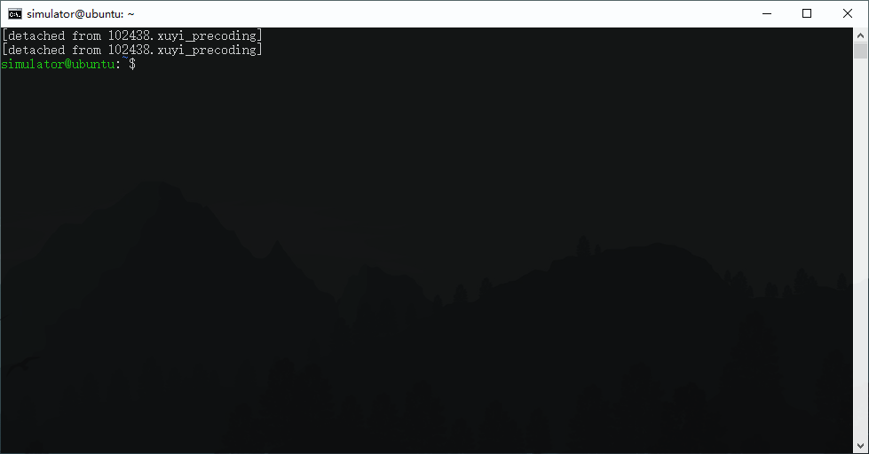

7. 查看当前所有的screen
    > screen -ls

8. 若要查看运行情况，可将挂起的screen调至前台
    > screen -r [screen_name]

    例：
    > screen -r xuyi_precoding

    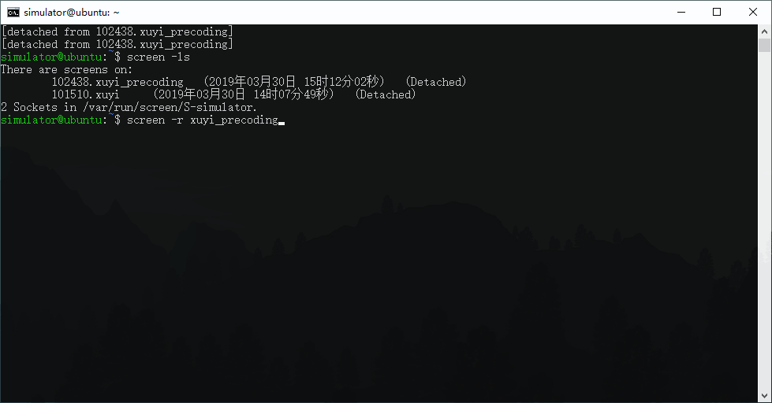

8. 若完成仿真，退出MATLAB和当前screen（务必退出两次）
    > exit

    > exit

    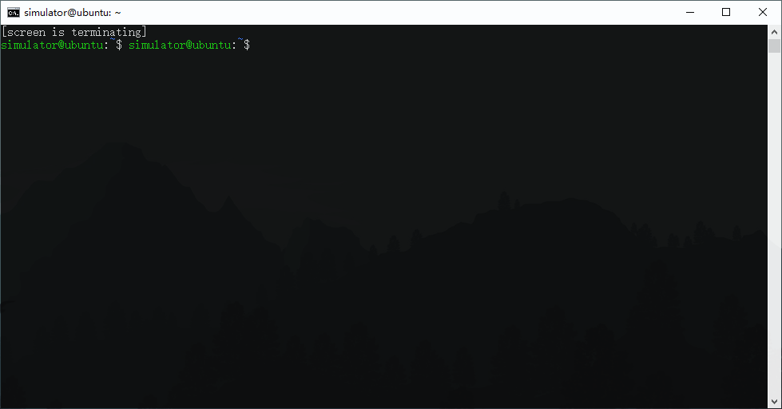

## 五、将结果传回本地
1. 使用CMD/PowerShell/WSL并进入待传回数据的目录。
    > cd [path]

    例：
    > cd C:\Users\SherlockHsu\OneDrive\Current_Work

2. 利用scp命令将脚本生成的[mat_file]文件传回本地
    > scp simulator@10.129.4.22:~/[user_name]/[Robust_Linear_Precoder]/[mat_file] .

    例：
    > scp simulator@10.129.4.22:~/xuyi/Robust_Linear_Precoder/result.mat .

    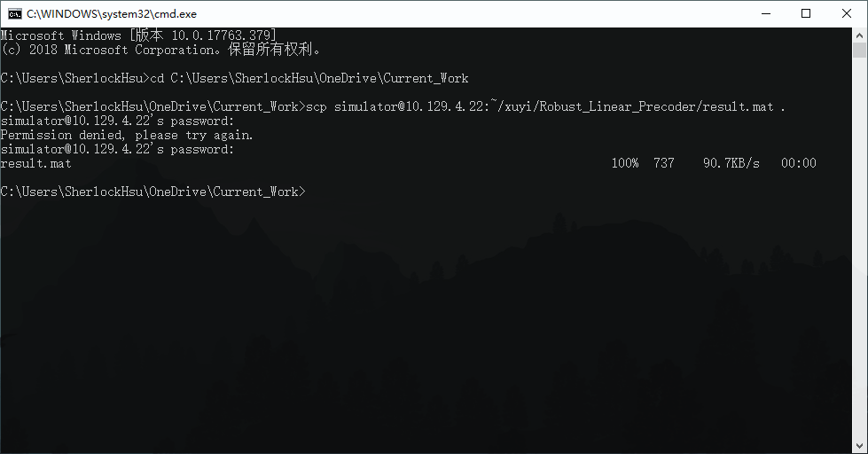
